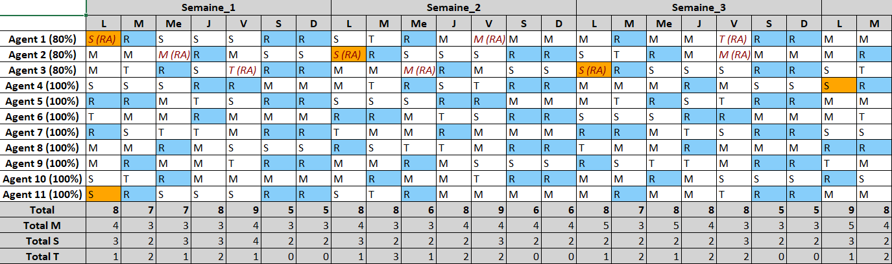

# FairnessNSP: A Nurse scheduling problem (NSP) ILP optimization with a fairness constraints
This repo contains a code to build schedules for a set of agents under linear constraints, following our [paper](http://dx.doi.org/10.13140/RG.2.2.28819.90405). We recommend reading it before running the code.
The project revolves aroung the Integer Linear Programming (ILP) optimization problem formalism.
The problem is solved using the [PuLP](https://pypi.org/project/PuLP/) library.

The script is primarily intended to design schedules for a hospital service under a list of its specific constraints, but can be adapted for any similar problem.
The parameters and constraints provided correspond to a real-life case in a French hospital's service.
It enabled to ensure the compliance of the computed solutions with the expectations of the service's management.

Two sets of agents are dealt with in the repo:
- nurses (refered to with the "inf" suffix in filenames, standing for "infirmier" in French)
- caregivers (refered to with the "as" suffix in filenames, standing for "aide-soignant" in French)

The output `.xlsx` file should look like the following screenshot:



# Overview of files
- `script_inf.py`/`script_as.py` : main scripts to build a nurse/caregiver schedule.
- `excel_export.py`: OpenPyXL functions to generate the output `.xlsx` schedule files.
- `objectives.py`: PuLP objective functions that can be used as an optimization criterion in the main scripts.
- `parameters/parametres_inf.py`/`parameters/parametres_as.py`: parameters files to pilot the associated script.
- `requirements.txt`: the list of dependencies with the versions used to lead the study.
- `output/nurses_schedule.xlsx`/`output/caregivers_schedule.xlsx`: an example of output schedule with the provided parameters for the two teams of nurses and caregivers.

# Dependencies
[Pandas](https://pandas.pydata.org/), [OpenPyXL](https://openpyxl.readthedocs.io/en/stable/) and [PuLP](https://pypi.org/project/PuLP/).

A quick way to install it is creating a virtual environment or a conda environment and to run:
```
pip install -r requirements.txt
```

# Running the code
To run the code and generate a nurse schedule, fill the `parameters/parametres_inf.py` file and run
```
python script_inf.py
```
The logs will indicate if the problem was successfully resolved (logs will display `Optimal solution`) or if it failed (logs will display `Infeasible`).
If the program is successful, the resulting `.xlsx` file will be stored in the `output` folder.


# License and attribution
This code is made available for use under the terms of the Creative Commons Attribution-NonCommercial-ShareAlike 4.0 International (CC BY-NC-SA 4.0). You may obtain a copy of the License at: https://creativecommons.org/licenses/by-nc-sa/4.0/.


# Citation
If you use this work, consider citing our [paper available on ResearchGate: ](http://dx.doi.org/10.13140/RG.2.2.28819.90405):

```latex
@misc{https://doi.org/10.13140/rg.2.2.28819.90405,
  doi = {10.13140/RG.2.2.28819.90405},
  url = {https://rgdoi.net/10.13140/RG.2.2.28819.90405},
  author = {Chirol,  Louis and Zeroual,  Jad},
  language = {en},
  title = {Using fairness as a constraint in the Nurse scheduling problem (NSP): the case of a French hospital},
  publisher = {Unpublished},
  year = {2024}
}
```

